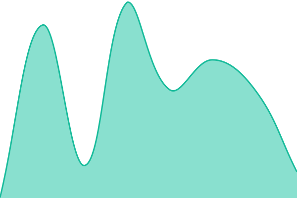
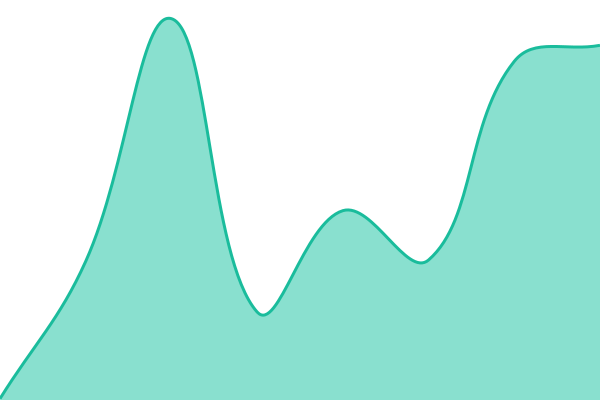
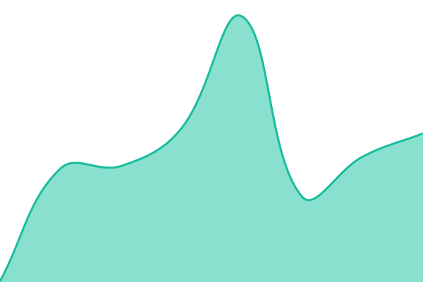
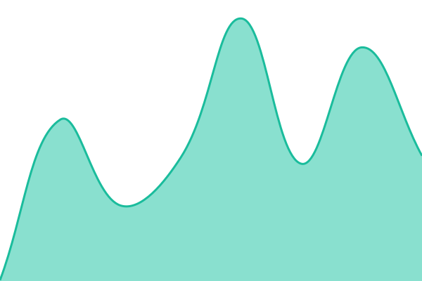

# [📈 Live Status](https://whatsbruin.github.io/uptime/): <!--live status--> **🟧 Partial outage**

<!-- This repository contains the open-source uptime monitor and status page for [Upptime](https://upptime.js.org), powered by [Upptime](https://github.com/upptime/upptime).

<!-- With [Upptime](https://upptime.js.org), you can get your own unlimited and free uptime monitor and status page, powered entirely by a GitHub repository. We use [Issues](https://github.com/upptime/upptime/issues) as incident reports, [Actions](https://github.com/whatsbruin/uptime/actions) as uptime monitors, and [Pages](https://upptime.github.io/upptime) for the status page.

<!--start: status pages-->
<!-- This summary is generated by Upptime (https://github.com/upptime/upptime) -->
<!-- Do not edit this manually, your changes will be overwritten -->
<!-- prettier-ignore -->
| URL | Status | History | Response Time | Uptime |
| --- | ------ | ------- | ------------- | ------ |
|  [ecovery software](https://ecoverysoftware.com) | 🟩 Up | [ecovery-software.yml](https://github.com/whatsbruin/uptime/commits/HEAD/history/ecovery-software.yml) | 

 158ms
     
 | 

<a href="https://whatsbruin.github.io/uptime/history/ecovery-software">100.00%</a>
    

|  [the lucid loop](https://thelucidloop.com) | 🟩 Up | [the-lucid-loop.yml](https://github.com/whatsbruin/uptime/commits/HEAD/history/the-lucid-loop.yml) | 

 163ms
     
 | 

<a href="https://whatsbruin.github.io/uptime/history/the-lucid-loop">100.00%</a>
    

|  [call freeman](https://callfreeman.com) | 🟩 Up | [call-freeman.yml](https://github.com/whatsbruin/uptime/commits/HEAD/history/call-freeman.yml) | 

 158ms
     
 | 

<a href="https://whatsbruin.github.io/uptime/history/call-freeman">100.00%</a>
    

|  [davis carpentry](https://daviscarpentry.com) | 🟩 Up | [davis-carpentry.yml](https://github.com/whatsbruin/uptime/commits/HEAD/history/davis-carpentry.yml) | 

 153ms
     
 | 

<a href="https://whatsbruin.github.io/uptime/history/davis-carpentry">100.00%</a>
    

|  [garys lists](https://garryslist.org) | 🟩 Up | [garys-lists.yml](https://github.com/whatsbruin/uptime/commits/HEAD/history/garys-lists.yml) | 

 638ms
     
 | 

<a href="https://whatsbruin.github.io/uptime/history/garys-lists">18.51%</a>
    

|  [Vin searc](https://visor.vin.com) | 🟥 Down | [vin-searc.yml](https://github.com/whatsbruin/uptime/commits/HEAD/history/vin-searc.yml) | 

 0ms
     
 | 

<a href="https://whatsbruin.github.io/uptime/history/vin-searc">60.25%</a>
    

<!--end: status pages-->

[**Visit our status website →**](https://upptime.github.io/upptime)

## 📄 License

- Powered by: [Upptime](https://github.com/upptime/upptime)
- Code: [MIT](./LICENSE) © [Anand Chowdhary](https://anandchowdhary.com), supported by [Pabio](https://pabio.com)
- Data in the `./history` directory: [Open Database License](https://opendatacommons.org/licenses/odbl/1-0/)
